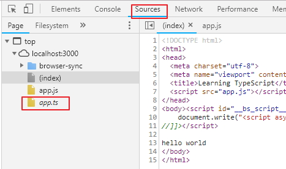

# 參考資料
* https://ithelp.ithome.com.tw/users/20103639/ironman/1306

# 一、執行 TypeScript
  1. 安裝 TypeScript     
        > $ npm install -g typescript
  
  2. compile ts 檔案 (會產生HelloWorld.js檔案)
        > $ tsc HelloWorld.ts   
  
  3. 執行js檔案
        > $ node HelloWorld.js

# 二、TypeScript 語法範例
  1. Variable.ts
      * 變數宣告

  2. Function.ts
     * 函數型別   
     * 選擇性參數
     * 預設參數
     * 剩餘參數
     * Lambda運算式和使用‘this’
  
  3. Interface.ts
     * 基本型
     * 選擇性屬性 (Optional Properties)
     * 函數型別 (Function Types)
     * 陣列型別 (Indexable Types)
     * 類別型別 (Class Type)
     * 擴充介面
     * 混合型別 (Hybird Type)
   
  4. Class.ts
     * 基本型 (Basic Classes)
     * 繼承 (Inheritance Classes)
     * public, private, protected 修飾符 (public, private 和 protected modifiers)
     * 靜態屬性 (Static Properties)
     * 抽象類別 (Abstract Class)
  
  5. MyFirstProject 建立第一個專案
     * 建立MyFirstProject資料夾為第一個專案
     
     * 在MyFirstProject 資料夾中建立以下2個檔案
       - index.html
       - app.ts
       
     * npm 初始化專案 (會產生package.json設定檔)
         > $ npm init
     
     * 安裝lite server
         > $ npm install lite-server --save-dev
     
     * 建立啟動lite server 指令
       - 開啟 package.json
       - 在 scripts 中加入 "start": "lite-server"
         
       - 啟動 lite server
         > $ npm start 
     
     * TypeScript初始化專案 (會產生tsconfig.json設定檔)
         > $ tsc --init
     
     * complie專案中所有的ts檔案
         > $ tsc

     *  **注意如果第一次下載MyFirstProject時，裡面沒有node_module 資料夾時，要先安裝相關套件**
        
yarn 會參考package-lock.json 安裝相關套件

        > $ yarn install
        
可以延長timeout時間: yarn install --network-timeout 1000000 

        
     * tsconfig.json 說明
        * [tsconfig.json設定檔說明](http://   www.typescriptlang.org/docs/handbook/tsconfig-json.html "tsconfig.json設定")
        
        * 執行tsc complier時可以下的參數
          [tsc complier 的參數](http://www.typescriptlang.org/docs/handbook/compiler-options.html "tsc 參數")

        * sourceMap
         
          
設定為true時，在complier完成後，在Browser中可以顯示js檔案是對應哪一個ts檔案

          
        * noImplicitAny
          
會提示需要設定為any的變數

        * noUnusedParameters
          
在complie時，會顯哪些變數是沒有被用到的

        *     
     *  
  
  6. 